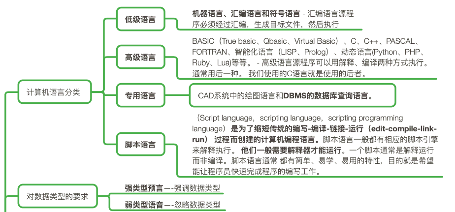
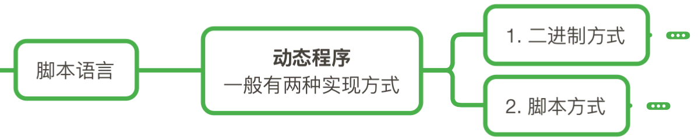
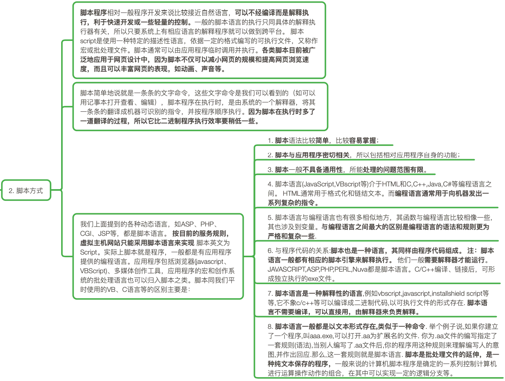

# 编程

> 计算机编程必须掌握的相关知识思维导图。

**思维导图笔记本 ：** <https://helloworld1661.github.io/learnToCode>

**仓库位置：** <https://github.com/HelloWorld1661/learnToCode>

## 编程语言

### 计算机语言分类

### 对数据类型的要求

### 计算机高级语言

#### 编译型语言

#### 解释型语言

#### 混合型

### 脚本语言

#### 二进制方式

#### 脚本方式

## 技术栈

## 设计模式

