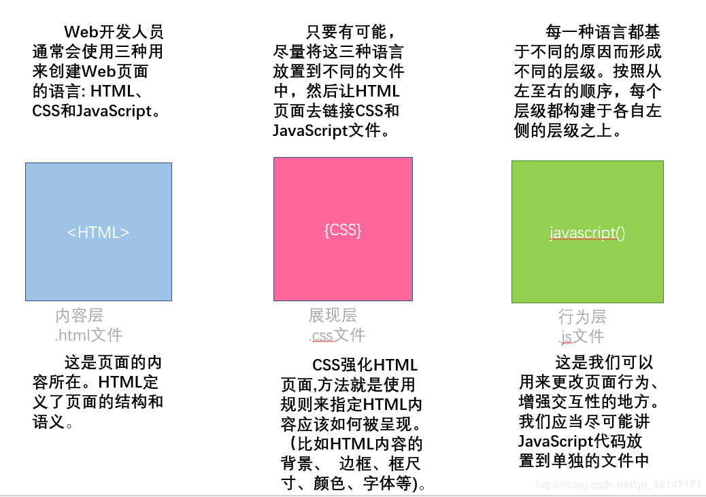
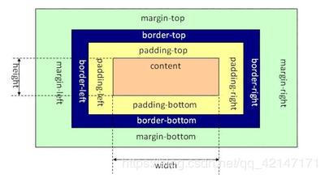

## HTML的概念以及基本的结构

HTML的概念：是一种用来制作超文本文件的简单标记语言。
超文本文件中可以包含图片、声音、动画、影视等内容，而不仅仅是文本信息。另外超文本文件还可以通过链接从一个页面跳转到另外一个页面，从而与世界各地的主机相连。

## 二、HTML、CSS、JavaScript之间的联系

三者的关系可以用房子来描述。如果说一个html页面就是一个房子的话，那么其中的html元素就好比建成房子的砖、木、土、钢、水泥、沙子等各种材料，css就是让房子看起来像怎样的设计规范或者图纸，javascript就是用来调整用css规范建成的房子的各个已经就位的元素，让它们能够灵活地移动或者活动，比如控制一个门是开着还是关着的，把桌子从左边移动到右边等等。html是基础,css是表态地规范html元素的位置大小颜色等等状态的，而javascript则可以动态地控制html元素。
在html中最重要的就是盒模型，在html中所有的过程都是按照盒模型来构建的。

